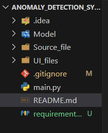
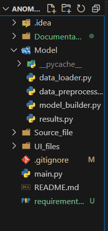
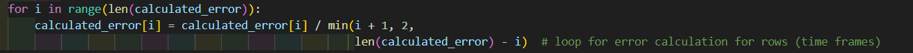
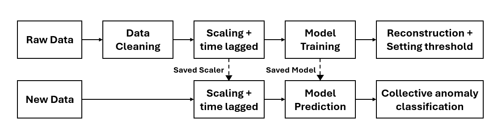

# anomaly_detection_system

Welcome to the github repository for anomaly detection system. 

Anomaly detection system is used for identification of rare events or observations that differ significantly from the standard distribution values. The underlying concept applied here is training the LSTM - Autoencoder model using normal values and act unsupervised on the new coming data values. The PyQt5 application is entirely coded in python. Keras is used for the implementation of the model.

## Documentation

### How to start modifying the application

Start by cloning the repository

'''
$ git clone https://github.com/ThijmenG/anomaly_detection_system.git

'''

Make sure to install the required dependencies before running the py files.

'''
pip install -r requirements.txt
'''

### How to use the repository

Open the Anomaly Detection System folder 

The Model folder contains all the snippets required to modify the data and model structure

The data_loader.py contains functions that is responsible for exporting the formatted data for further processing. If any issue arises in formatting or data loading, make sure to go through this py file for debugging.

The data_preprocessor.py contains functions that is responsible for data preprocessing required for the model. The threshold required for capping can be found in outlier_treatment(). The scaled_train() can only be called during the training and scaled_predict() during prediction. The time_lagged() function should be called during the training and prediction phased. The number of timelagged features can be changed by setting the n_past variable to the required number of timelagged features.

The model_builder.py contains the implementation of model initialization, training and plotting the training curves. Changing the optimizers, batch_size, epochs and learning rate can be performed in train_model() function. 

The results.py contains the functions for prediction and classifying the anomalies. If any change is made on number of time lagged features, the error calculation will change based on it. Make sure to change the 2 inside the minimization function to the altered time lagged feature values.

If the model is re-trained on new data, the error distribution changes based on which thresholds will change. Make sure to change the threshold under each switch case statement to the new threshold values decided.

### Changing the pipeline

Any changes in the flow of the anomaly detection pipeline can be changed in model_handler.py under the UI_files folder.

The current system follows the architecture specified below,

Further details on technicality of the implementation and information regarding the decisions can be referred from the report.

